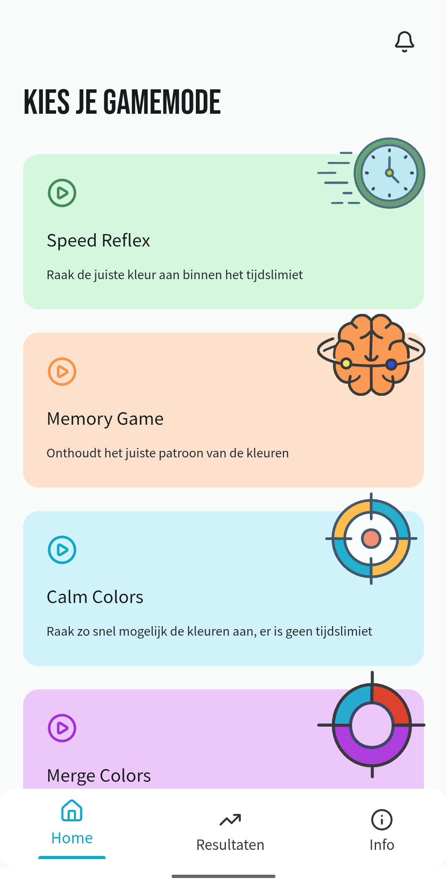

In mijn tweede jaar van MCT, hadden we een interne klant voor wie we een project moesten maken in een team, ons project was een spel dat mensen van alle leeftijden en sportniveau's helpt om hun reactiesnelheid te testen en verbeteren.

We hebben daarvoor een website gemaakt die lokaal gehost werd op een Raspberry Pi die geconnecteerd is met 4 kegels van verschillende kleuren, elke kegel heeft een ESP32, batterij, TOF-sensor (sensor om te detecteren of iemand op een kegel tikte), buzzer (voor geluidjes) en een rgb led (om de batterijstatus weer te geven).

We hebben volgende gamemodes gemaakt:

- **Speed Reflex**: een kleur verschijnt op het scherm en de speler moet de kegel met het juiste kleur aantikken
- **Memory Game**: een reeks kleuren verschijnt op de website en de speler moet de kegels in de zelfde volgorde aantikken
- **Calm Colors**: hetzelfde als Speed Reflex, maar er is geen tijdslimiet
- **Merge Colors**: een kleur verschijnt op het scherm en de speler moet de 2 kegels aantikken, die wanneer je ze zou mengen (zoals verf) ze het kleur op het scherm vormen

Ik heb het meeste van de FastAPI backend gemaakt en ook veel geholpen met de wireframes en design in Figma.
